Say you have a system. You want to introduce a new element. Or maybe you just want a tweak, a small change of workflow. The hard part about doing this isn’t the implementation. It’s getting through to your users and convincing them that this change will benefit them. Once that initial resistance to change is defeated and the user rests assured you’re working in their interest, the work is halfway done. 

At Code for Romania, we’re already dancing to our own tune, the one we crafted together. I’m stepping away from the dancefloor and I want to sit with you, dear reader, and explain the rhyme and reason of the dance you’re watching. It will take a while, but bare with me. You won’t regret reading all the way to the end of this article. 

**Rumour has it**

Our organization if very different from a traditional non-profit practice. The field of civic tech is fairly new in our country. It’s only natural that most people didn’t initially understand how we function. In the past three years, we’ve collected anecdotes about what people think we do. I want to take this opportunity to set things straight: I want you to be able to tell fact from fiction.

Our mission statement, in its simplest form, says that we build open source digital solutions, pro-bono, to fix societal problems. Here is what some people assumed and we realized we never really took a long enough time to explain them properly:

**A. Code for Romania creates websites for NGOs, for free** - FALSE   
The answer is no. We do not create websites for free, for any organization. We identify social, systemic and general issues in Romania (and, sometimes, in a region, or the world) and, together with partner organisations, we build a functional, up to standards, open source digital solution for that issue.

{}

**B. Code for Romania is a franchise** - FALSE   
The answer is no. Code for Romania is a member organization of Code for All, an international network of civic tech organisations who operate differently in various countries all over the world. Each member of Code for All has his own management, structure, workflow, membership policy, volunteering system etc. We support each other and we collaborate as a network, but every single "Code for" is independent and autonomous.

**C. Code for Romania is the former GovITHub** - FALSE   
Code for Romania was started in the beginning of 2016 by a handful of people living abroad at that moment in time. It was inspired by Code for America, but developed to bring a meaningful impact in the Eastern European context, and in the Romanian space. Code for Romania has become a legal entity in July 2016 and has never been part of GovITHub. The two entities have launched almost at the same time but they have always had different missions and methodologies.

**D. Code for Romania takes project ideas from civil society and develops them into tech solutions** - CURRENTLY FALSE   
The answer is: not anymore. In the beginnings of Code for Romania, we had an open call for civic tech projects directed at NGOs, institutions and citizens. We asked all of these actors what their problems are and how they can be fixed. It didn't work.

In three years of trial and error, of taking each new incoming proposal through research and analysis, we have realized that:   
a) most NGOs do not have the necessary resources to perform in-depth research on specific issues. They do their best in fixing problems in their area of activity and sadly, here isn't much time or financial support left for more;   
b) NGOs do not have the resources (and nor should they, by default) to understand if a digital instrument is the answer to their needs, and if it is, what this instrument should look and work like;   
c) public institutions usually lack the resources and attractiveness to hire top IT professionals;   
d) a lot of time and money are wasted on ideas that more often that not fail at launch or immediately after, which lowers grant makers’ trust in the capacity of NGOs to build  real impact with every new tech project.

All of the above, corroborated with the fact that we work as a volunteer organization and we must optimize the work and skills we allocate to solve each issue signaled to us has led us to change our model. Therefore, from "tell us what you need and we'll develop it" we switched to "let's identify the issues together, in an organized, thorough way and fix them."

**How does it work then?**

The entire Code for Romania activity is structured in two major phases: the Civic Lab and the Tech for Social Good programs. Here is how they work together:

{}

*Phase one: The Civic Lab:*

The Civic Lab is the civic tech solutions generator. It is the place where issues are analyzed and civic apps are shaped to solve them. Not overnight, but through a very time and effort consuming process detailed below:

  

    

      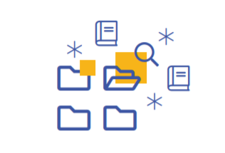
    

  

  

      

        1. We choose one or more fields of research. I will use an example for a better understanding of the process. Let's say, Open Legislation.
      

  

  

    

      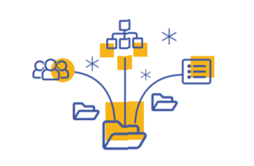
    

  

  

      

        2. We map the field in order to understand what it entails and who the stakeholders of the domain are. That means that we break down the Open Legislation area into smaller bits and pieces such as: Consolidated legislation, Legislative process, Local legislation, National legislation, European legislation, Proposed legislation etc. Then we also identify the organisations and groups of people who have a direct involvement in the above listed areas: legislators, governance NGOs, experts, lawyers, legal counseling companies etc.
      

  

  

    

      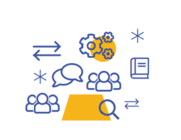
    

  

  

      

        3. We bring everyone around the table and we dive deep into the field in order to identify the pain points and the issues in the processes and to understand what causes those pain points and what nurtures their continuous presence. We do that through interviews, focus groups, desk research and many other practices.
      

  

  

    

      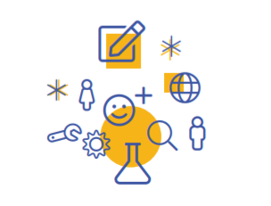
    

  

  

      

        4. We do user and problem research to figure out how the issues could be fixed and whether the solution can be achieved (or even solved completely) through a technical solution. At the same time we do tech research to understand how other people in other countries have solved similar issues to learn from their success or failure. At the end of this phase we have a complete file for each of the issues we found and a clear picture on ways of solving them.
      

  

  

    

      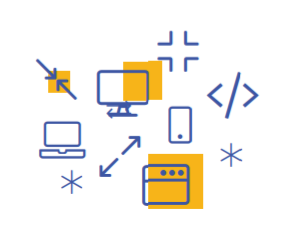
    

  

  

      

        5. We incubate and prototype these solutions and we test them with real users to be sure that they will achieve the impact we need and if the problems are truly fixed.
      

  

  

    

      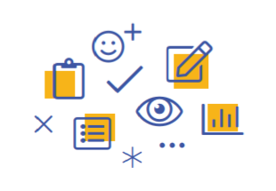
    

  

  

      

        6. We open all the solutions for everyone to see, analyze and interact with. We publish them on a single platform and from here on, the possible outcomes are (a) we develop them in our Tech for Social Good programme, (b) a company decides to develop a solution pro-bono, (c) a foundation or a grant maker offers to support the development of a solution by another NGO.
      

  

 
*Phase two: Tech for Social Good*

You know how, usually, people talk about what needs to be done in a very impersonal manner? "This needs to be done", "this should be solved", "that needs fixing". But they never say who should do it nor, more importantly, do it themselves. Well, we figured that it's time to show people that nobody is coming to solve our issues, therefore it is up to us. **We are the ones we've been waiting for**.

  

    

      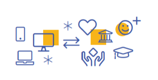
    

  

  

      

        1. A part of the prototypes we build in the Civic Lab become real civic apps in our Tech for Social Good program.
      

  

  

    

      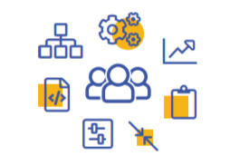
    

  

  

      

        2. A senior tech team builds and maintains the necessary architecture and infrastructure for the development of these apps, while the Code for Romania volunteers work on making them a reality.
      

  

  

    

      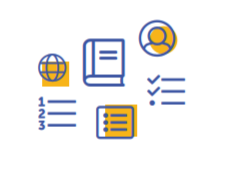
    

  

  

      

        3. This happens according to a set of standards and a simple flow taking place both online and offline.
      

  

  

    

      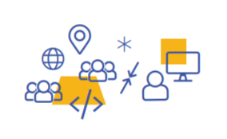
    

  

  

      

        4. Developers who join Code for Romania as volunteers may work online (using our Slack and the GitHub repositories) whenever they feel comfortable, solving tasks listed in our public repositories or they can join one (or more) of the monthly HackDays happening in Bucharest, Cluj-Napoca, Iasi or Timisoara to work together with our tech team in real time in a physical location.
      

  

  

    

      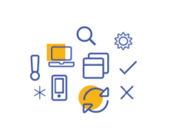
    

  

  

      

        5. The apps are developed, tested, launched, communicated, monitored and improved.
      

  

  

    

      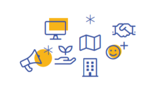
    

  

  

      

        6. Some of the apps are administered and communicated after launch together with partner organisations. For example, our Theater Hub app will be managed by our partners at Punct.Art, an active NGO is the cultural sphere.
      

  

 
Each and every single bullet in the list above has an entire philosophy and reasoning behind it and it has been designed taking into account all of our prior experience, best practices, local context and numerous other expert opinions and evaluations. We do not just do tech, we do tech that works. At the same time the two programs fuel each other continuously, therefore there is no more stalling in either development or research or incubation.

**Last but not least**

I didn't want to end this very technical and full of information article just like that. But also because I am not the one to just throw in things without a point I feel the need to back-up all I've told you with numbers and facts.

* 600+ volunteers registered 
* 150+ active at all times
* 60.000+ pro-bono working hours
* 8 civic apps launched 
* 4 domains under focus in Civic Lab
* 7 active civic apps in development in Tech for Social Good
* 200+ national, local and international events 

If Code for Romania wasn't a necessity, those numbers wouldn't be possible. If **civic tech** was just a buzzword, we'd be out of fashion by now already. 

This being said, I am looking forward to meeting you, our reader, at [our next HackDay](https://tfsg.code4.ro/), at any of our local meetups, or even to hearing from you at contact@code4.ro. We'd also be very grateful if you could help us maintain and grow those numbers above even further by supporting us with a recurring donation. Infrastructure and civic tech doesn't just drop from the clouds (see what I did there? Cloud? #awfuljoke). 

See you soon! 

