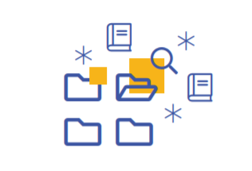
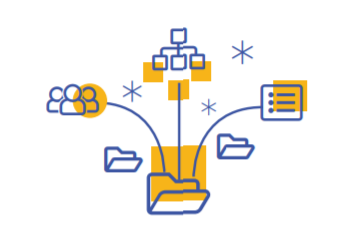
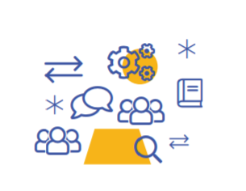
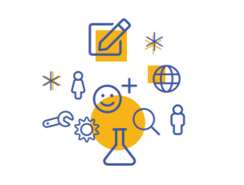
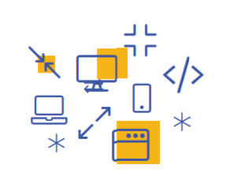
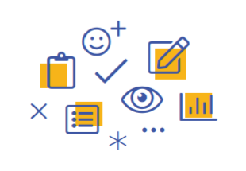
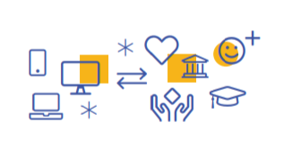
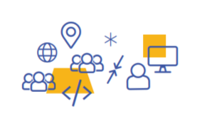
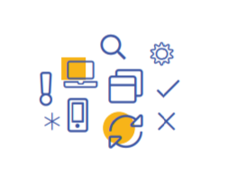

Hai să zicem că ai un sistem și vrei să introduci un nou element în el. Sau poate vrei să faci o modificare, o schimbare a modului de funcționare. Nu implementarea e partea care o să-ți facă probleme. Partea grea e să convingi utilizatorii pe care îi ai deja că schimbarea asta le va aduce un beneficiu. Dacă reușești să treci peste această rezistență inițială la schimbare și utilizatorii tăi sunt convinși că schimbările pe care le faci sunt spre binele tuturor, adică dacă au încredere în tine, munca e pe jumătate gata.

La Code for Romania, noi mergem în ritmul nostru, un ritm pe care ni l-am stabilit împreună. Iau o pauză de la tot acest du-te-vino și mă alătur ție, cititorule. Vreau să-ți explic motivația din spatele tuturor lucrurilor pe care le vezi. O să dureze, dar ai răbdare cu mine. N-ai să regreți că ai citit articolul acesta până la final. 

**Umblă zvonul că…**

Organizația noastră e destul de diferită de ONG-urile tradiționale cu care poate că ești deja obișnuit. Civic tech (tehnologia civică) e un domeniu destul de nou în România. E normal ca oamenii să nu înțeleagă de la început cum funcționăm. În ultimii trei ani am strâns diverse zvonuri și anecdote despre ce cred oamenii că facem. Hai să vedem împreună ce e real și ce nu. 

Mission statement-ul nostru, în cea mai simplă formă, spune că ne ocupăm pro-bono cu construcția de soluții digitale open source pentru a rezolva probleme sociale. Pornind de la asta, iată ce au presupus unii oameni despre noi, și ce ne-am dat seama că nu am clarificat îndeajuns în mod oficial:

**A. Code for Romania face site-uri gratis pentru ONG-uri** - FALS   
Răspunsul e nu. Nu facem website-uri gratis pentru nimeni, ONG sau nu. Scopul nostru e să identificăm probleme sociale sistemice și generalizate în România (și uneori la nivel regional sau global) și, împreună cu organizații partenere, construim soluții digitale open source funcționale și state-of-the-art pentru a rezolva acele probleme.

{}

**B. Code for Romania e franciză** - FALS   
Răspunsul e iarăși nu. Code for Romania e membră a Code for All, o rețea internațională de organizații de civic tech care operează în mod diferit în țări diferite. Fiecare membru Code for All are propria conducere, propria structură, workflow-uri, politici de membership și sisteme de voluntariat diferite. Ne susținem reciproc, colaborăm în cadrul rețelei de parteneri, dar fiecare “Code for” e independent și autonom.

**C. Code for Romania e fostul GovITHub** - FALS   
Code for Romania a fost fondat la începutul lui 2016, de o mână de oameni care locuiau în diaspora la momentul respectiv. Am folosit Code for America drept sursă de inspirație, dar am dezvoltat o structură proprie mai adecvată contextului est-european. Code for Romania a devenit entitate legală înregistrată în iulie 2016 și nu a fost niciodată parte din GovITHub. Cele două entități au fost lansate aproape în același timp, dar au avut dintotdeauna misiuni și metodologii diferite.

**D. Code for Romania primește idei din societatea civilă și le dezvoltă în soluții tech** - (DE CEVA TIMP ÎNCOACE) FALS    
Code for Romania nu mai primește sugestii de proiecte din societatea civilă. La început am avut un open call  pentru idei și proiecte de civic tech la care au participat ONG-uri, instituții, precum și cetățeni simpli cu idei bune. Am întrebat toți acești actori ce probleme au și cum le putem rezolva. Nu a funcționat.  

În trei ani de încercări și greșeli, de trecut fiecare propunere primită prin procese îndelungate de cercetare și analiză am ajuns la câteva concluzii:    
a) majoritatea ONG-urilor nu au resursele necesare să facă cercetare în amănunt pe probleme specifice. Fiecare ONG face ce poate pentru a rezolva probleme punctuale și presante din domeniul său de activitate. Din nefericire asta nu îi lasă mult timp sau multe resurse acelui ONG pentru un proces laborios de cercetare sistemică;   
b) majoritatea ONGurilor nu au (si nici nu ar trebui să aibă by default) resursele pentru a înțelege dacă un instrument digital e soluția optimă pentru problemele cu care se confruntă. Chiar dacă o soluție digitală ar fi instrumentul optim, de cele mai multe ori ONG-urile nu știu cum ar trebui să arate acel instrument și cum ar trebui să se comporte;   
c) instituțiile publice nu au de obicei nici resursele nici “atractivitatea” pentru a angaja profesioniști IT de top;   
d) extrem de mult timp și extrem de mulți bani sunt irosiți pe idei tech care de cele mai multe ori dau greș de la lansare sau la scurt timp după. Acest lucru scade încrederea donatorilor și furnizorilor de granturi în capacitatea ONGurilor de a avea un impact real și direct prin proiecte tech.   

Toate cele de mai sus, dar și faptul că suntem o organizație de voluntari care trebuie să își optimizeze volumul de muncă și expertiză alocat pentru rezolvarea fiecărei probleme semnalate ne-au făcut să ne schimbăm modelul de funcționare. Astfel am trecut de la “spuneți-ne ce vă trebuie și noi vom dezvolta o soluție” la “hai să identificăm ce probleme există într-un mod organizat și riguros, iar apoi să le rezolvăm împreună”.

**Cum funcționează toată treaba asta, atunci?**

Întreaga activitate Code for Romania e structurată în două etape mari: procesul Civic Lab și programul Tech for Social Good. Iată cum funcționează împreună:

{}

*Prima etapă: Civic Lab*

Civic lab e un generator de soluții civic tech. Este locul unde analizăm probleme sociale și dăm formă unor soluții care pot rezolva aceste probleme. Acest lucru nu se întâmplă de pe o zi pe alta (România are, după cum știi multe probleme) dar se întâmplă ca urmare a unui proces extrem de laborios și riguros.

  

    

      
    

  

  

      

        1. Alegem unul sau mai multe domenii de cercetare. O să folosesc un exemplu, ca să fie totul mai ușor de înțeles. Să luăm ca exemplu Legislația deschisă - adică legislație, liber accesibilă publicului într-un format open-source.
      

  

  

    

      
    

  

  

      

        2. Mapăm domeniul, pentru a înțelege mai bine ce reprezintă și cine sunt părțile interesate. Asta înseamnă că în exemplul nostru împărțim domeniul legislației deschise în părți mai mici: Legislație consolidată ( adică la zi), proces legislativ, legislație locală, legislație națională, legislație europeană, propuneri legislative, etc. Apoi identificăm organizațiile și grupurile de persoane care au o implicare directă în zonele listate mai sus: membrii legislativului, ONG-uri din domeniul guvernării, experți, avocați, companii de consiliere legală etc.
      

  

  

    

      
    

  

  

      

        3. Aducem pe toată lumea la aceeași masă și ne uităm în detaliu la domeniu pentru a identifica punctele nevralgice și hibele din procesul legislativ și de implementare care duc la acele probleme. Facem acest lucru prin interviuri, focus grupuri, analiză documentară și alte practici.
      

  

  

    

      
    

  

  

      

        4. Facem cercetare UX, tech și cercetare axată pe probleme pentru a ne da seama cum am putea ameliora (sau rezolva complet) problema prin soluții tehnice. În același timp facem cercetare comparată pentru a înțelege dacă și cum au fost adresate problemele în alte țări, și încercăm să învățăm din succesele și eșecurile altora. La sfârșitul acestei faze avem câte o fișă completă pentru fiecare problemă identificată și o idee clară despre cum am putea rezolva acea problemă prin soluții digitale.
      

  

  

    

      
    

  

  

      

        5. Incubăm și prototipăm soluțiile și le testăm cu utilizatori reali pentru a ne asigura că rezolvă problema urmărită și că vor avea impactul real scontat.
      

  

  

    

      
    

  

  

      

        6. Prezentăm toate aceste soluții tuturor pe o platformă unică. Noi numim informal acest proces “punerea în vitrină” pentru că expunem soluțiile publicului larg care le poate vedea, analiza și poate interacționa cu ele. De aici există trei posibilități: (a) dezvoltăm noi soluția ca parte din programul Tech for Social Good (b) o companie decide să dezvolte una dintre soluții pro-bono, (c) o fundație sau un furnizor de granturi se oferă să susțină logistic și financiar dezvoltarea unei soluții identificate pentru un alt ONG.
      

  

 
*Etapa a doua: Tech for Social Good*

Știi cum, de obicei, lumea vorbește destul de impersonal despre probleme? “Asta trebuie să se facă”, “asta ar trebui rezolvat”, “chestia asta trebuie reparată”. Nimeni nu spune cine ar trebui să se ocupe de “asta” și nimeni nu se apucă vreodată să rezolve problema “aia" în mod direct. În trei ani, am ajuns la concluzia că e timpul ca oamenii să vadă că nu vine nimeni să ne rezolve problemele, trebuie să ni le rezolvăm singuri. **Noi suntem cei pe care îi așteptam**.

  

    

      
    

  

  

      

        1. O parte dintre prototipurile construite în Civic lab devin aplicații civice reale ca parte a programului Tech for Social Good.
      

  

  

    

      
    

  

  

      

        2. O echipă tech experimentată construiește și întreține arhitectura și infrastructura necesară pentru dezvoltarea acestor aplicații în timp ce comunitatea de voluntari Code for Romania lucrează la transformarea prototipurilor în aplicații reale.
      

  

  

    

      
    

  

  

      

        3. Acest lucru se întâmplă după un set de standarde și un flow simplu de urmat atât online cât și offline.
      

  

  

    

      
    

  

  

      

        4. Developerii care se alătură echipei de voluntari Code for Romania pot lucra online (cu ajutorul Slack-ului și al repository-urilor de pe GitHub) când vor și când se simt mai confortabil, rezolvând taskurile listate în repository-urile noastre publice. Cei care preferă să lucreze alături de echipele noastre tech în timp real, într-o locație fizică pot să se alăture  Hack Day-urilor lunare organizate de Code for Romania în București, Cluj-Napoca, Iași sau Timișoara.
      

  

  

    

      
    

  

  

      

        5. Aplicațiile sunt dezvoltate, testate, lansate, comunicate, monitorizate și îmbunătățite.
      

  

  

    

      
    

  

  

      

        6. Unele aplicații sunt administrate și comunicate după lansare alături de organizații partener. De exemplu aplicația Theater Hub va fi administrată de partenerii noștri de la Punct.Art, un ONG activ în sfera culturală.
      

  

 
Fiecare pas din cele două etape de mai sus are o întreagă filosofie și un raționament în spate și a fost conceput luând în considerare toată experiența noastră din ultimii ani, bune practici, contextul local și păreri și evaluări din partea experților. Nu facem doar tehnologie, ci tehnologie care funcționează. În același timp cele două programe se susțin, influențează și alimentează reciproc, constant, evitând astfel perioade de pauză și hiatus-uri în etapele de dezvoltare, cercetare sau incubare.

**Nu în ultimul rând…**

Nu vroiam să termin articolul ăsta foarte tehnic și plin de informație așa, din scurt. Dar pentru că nu sunt genul de persoană care doar povestește chestii, simt nevoia să susțin tot ce v-am arătat mai sus cu niște cifre legate de Code for Romania.

Code for Romania înseamnă:

* 600+ voluntari înregistrați
* 150+ voluntari activi 
* 60.000+ ore de lucru pro-bono
* 8 aplicații civice lansate
* 4 domenii în lucru în Civic Lab
* 7 aplicații în dezvoltare în programul Tech for Social Good
* 200+ evenimente naționale, locale și internaționale

Dacă organizația Code for Romania nu ar fi o necesitate, aceste cifre nu ar fi fost posibile. Dacă **civic tech** ar fi doar un buzzword și o poveste frumoasă, am fi fost de mult demodați.

Acestea fiind spuse, aștept să ne întâlnim, cititorule, la [următorul nostru HackDay](https://tfsg.code4.ro/), la unul din meetup-urile noastre locale sau în scris la contact@code4.ro. Ți-am rămâne de asemenea datori dacă ne-ai putea ajuta șă menținem și să creștem numerele de mai sus, susținându-ne cu o donație recurentă. Infrastructura și civic tech-ul nu cad din nori (nori? *Cloud? See what I did there?* #awfuljoke)

Pe curând!

