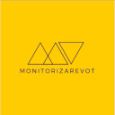
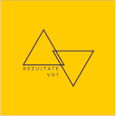

🚀🗳️🇷🇴

În loc să identificați și să parcurgeți în ore întregi texte legislative stufoase, acum puteți, accesând [Vot România](http://www.votromania.ro) și răspunzând la câteva întrebări simple, să obțineți în mai puțin de două minute toate informațiile privind procesul de vot din cadrul alegerilor locale. În curând, tot pe Vot România, veți putea afla exact secția de vot la care sunteți arondați. În acest moment sunt disponibile informații legate de alegerile locale de la 27 septembrie, 2020, dar vom actualiza website-ul cu fiecare nouă rundă electorală. Conținutul prezent pe platforma Vot România este realizat în parteneriat cu experții electorali ai Observatorului Electoral.

În plus, pentru că la alegerile locale au drept de vot toți locuitorii României care dețin o cetățenie a Uniunii Europene, toate informațiile sunt accesibile în română, maghiară și engleză.

Vot România este a patra aplicație din ecosistemul electoral dezvoltat de voluntarii Code for Romania. 



  

    

      
    

  

  

      

        Monitorizare Vot este soluția dedicată observatorilor electorali independenți - prima aplicație de monitorizare electorală din România, fiind și printre cele  mai utilizate sisteme de acest tip la nivel global. Lansată în 2016, aceasta a fost folosită la toate rundele electorale din ultimii patru ani și a fost preluată inclusiv în Polonia, în 2018, în cadrul primelor alegeri de acolo observate independent. 
      

  

  

    

      
    

  

  

      

        Vot Diaspora este o aplicație web destinată românilor de peste hotare pentru a le oferi sprijin pe durata alegerilor. Aici ei pot afla unde pot vota, de ce documente au nevoie sau ce proceduri trebuie să parcurgă pentru a vota. La ultima rundă a alegerilor prezidențiale, peste 185.000 utilizatori unici din diaspora s-au informat prin votdiaspora.ro.
      

  

  

    

      
    

  

  

      

        A treia soluție este Rezultate Vot, website lansat în 2019 cu ocazia alegerilor europarlamentare - o aplicație care oferă informații în timp real despre prezența la vot, rezultate și procesul de monitorizare a alegerilor. Începând din anul 2020 platforma va cuprinde întregul istoric electoral post-decembrist și alte funcționalități în premieră pentru România, fiind nu doar locul unde vor putea fi aflate cel mai rapid și ușor rezultatele alegerilor, ci și un bun instrument de analiză comparativă a datelor. 
      

  

 
Toate aplicațiile din ecosistemul dedicat alegerilor sunt proiectate de Code for Romania în cadrul programului Civic Labs și dezvoltate pro bono de către voluntarii noștri. [Civic Labs](http://www.civiclabs.ro) este programul prin care generăm soluții de tehnologie civică pentru probleme din șase domenii-cheie pentru România - educație, sănătate, mediu, grupuri vulnerabile, transparență și implicare civică.